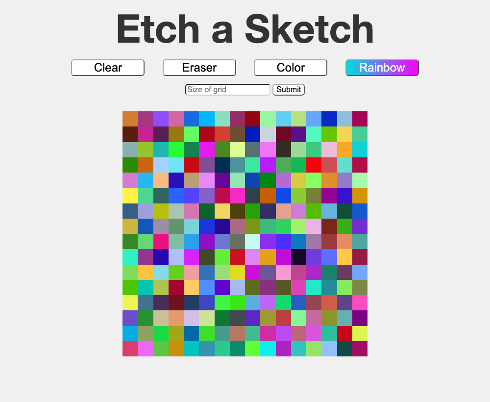

# Etch-a-Sketch

A browser drawing pad with a resizable grid. Move the mouse over the grid to
paint. One of [The Odin Project](https://www.theodinproject.com/) foundations
exercises.

## Run it

Open `index.html` in a browser. No build step.

## How it works

`createGrid(size)` builds a `size × size` grid of `
` cells using CSS Grid and
sizes each cell so the board stays 500px wide. Each cell gets a `mouseover`
listener that paints it according to the current `mode`:

| Mode | Behaviour |
|---|---|
| `default` | paint dark grey |
| `rainbow` | paint a random RGB colour |
| `eraser` | reset the cell to white |

Resizing prompts for a new cell count, tears down the old grid, and rebuilds it.
Clear repaints every cell white without changing the size.

## Built with

HTML · CSS Grid · vanilla JavaScript

## License

Released under the [MIT License](LICENSE).
